# WAD (Section#541) Project01 - Spending Tracker

## Live Demo
[Github Deploy Link](https://haoz20.github.io/spending-tracker/)

## Team Members
- Swan Htet Aung
- Thiri Htet
- Kaung Myat San


## Built With


## Page 1 (Analytics Dashboard)
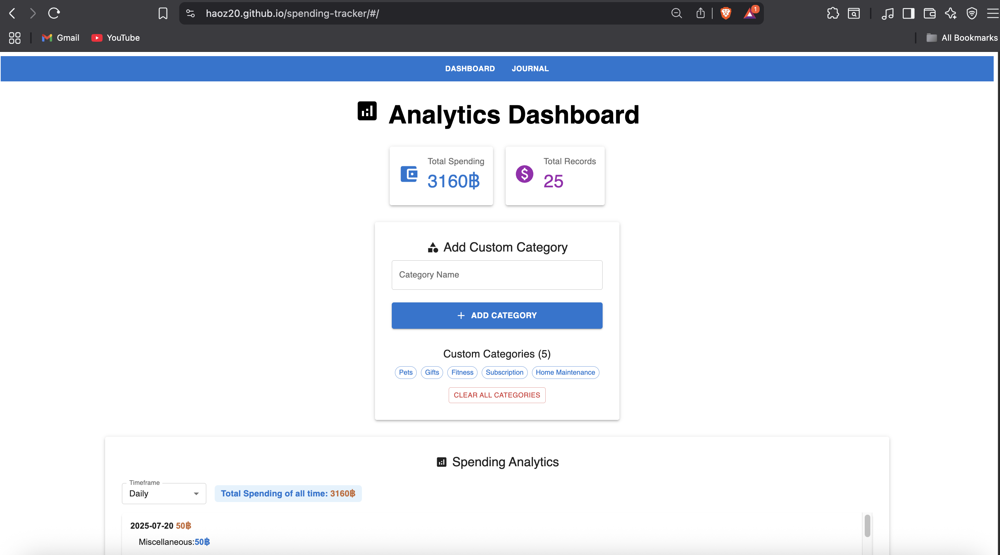

## Page 2 (Journal Page)
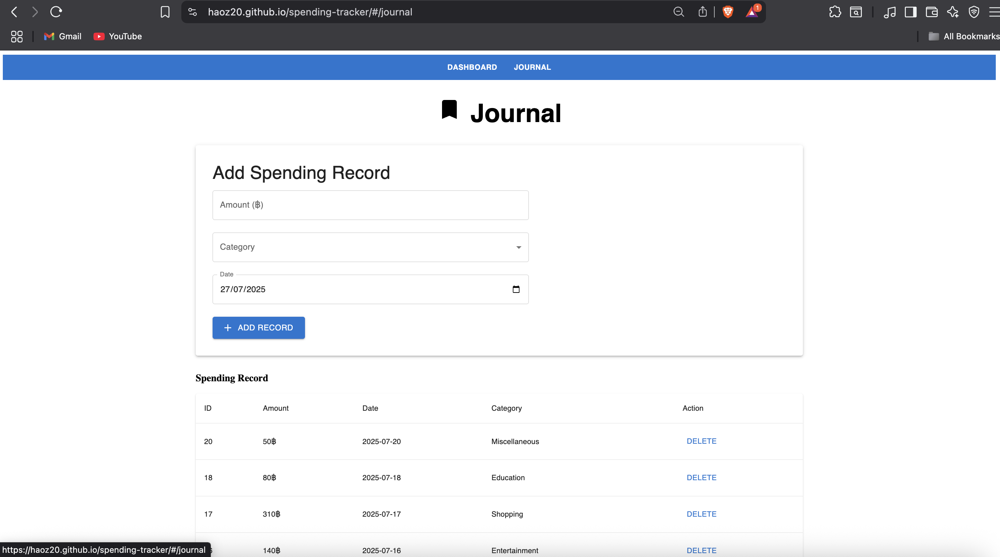


## Details of the pages
### Page 1: Analytics Dashboard
1. The app shows the summary of spending by selecting to show one of the three options: Daily, Weekly, and Monthly, and group by spending category.
   - Total spending of all time
   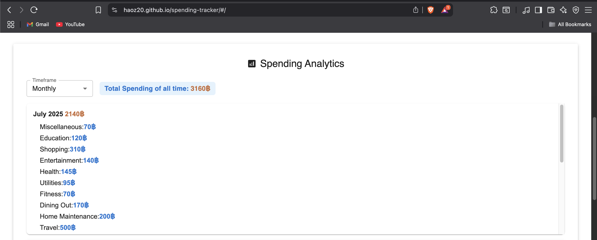
   - Total spending of the selected month
   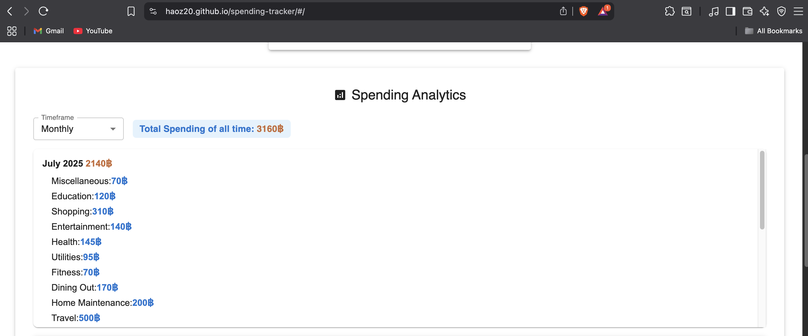
   - Total spending of the selected week
   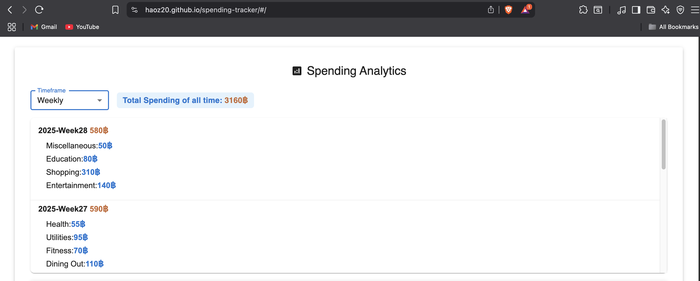
   - Total spending of the selected daily
   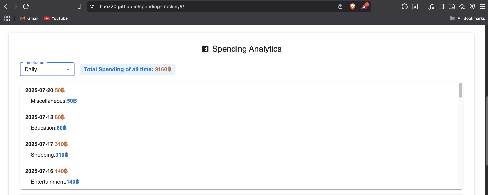
   - Self-Research - Line Chart of the spending (all time, selected month)
   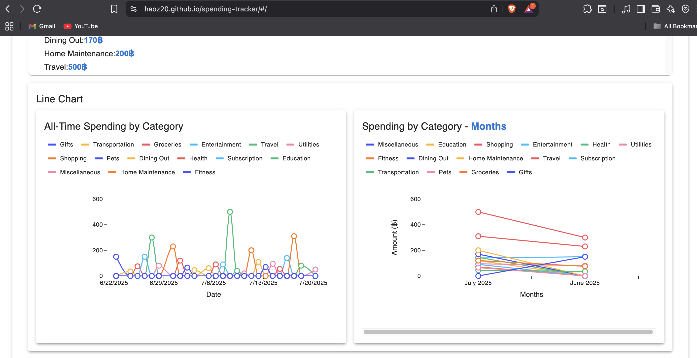
   - Self-Research - Pie Chart of the spending (all time, selected month)
   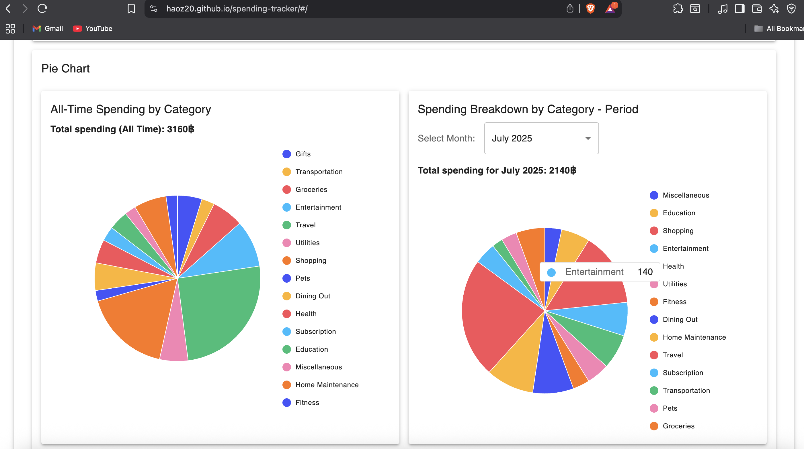
2. Can save extra spending category that is not in the list.
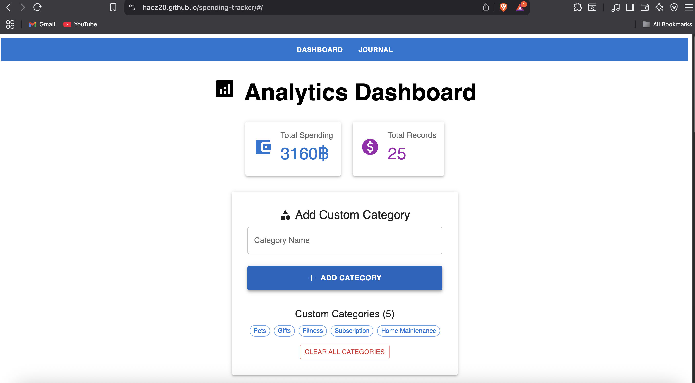


### Page 2: Journal
1. A spending category is in MS Teams' File section [spending-category.json].
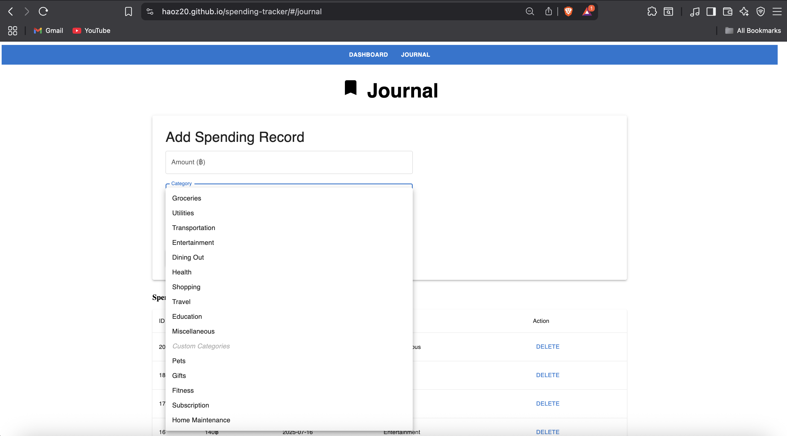
2. This is a single user app, there is no need to authenticate.
3. The user enters a record by providing the following at least:
   - Date (no time)
   - Spending category (from the list)
   - Amount
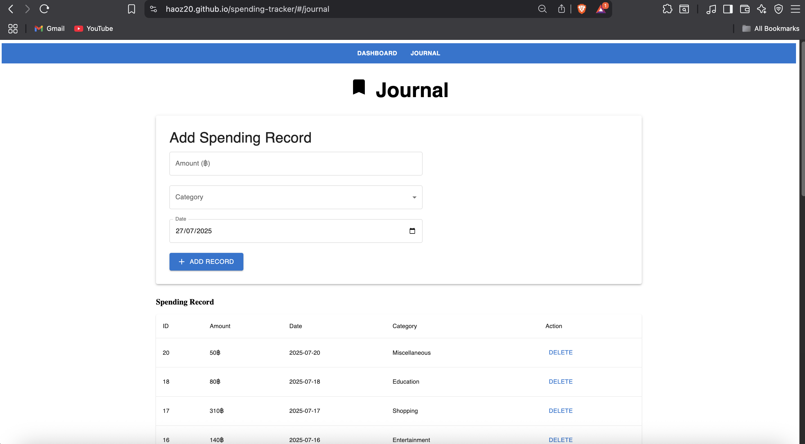


## Installation
1. Clone the repository:
   ```bash
   git clone https://github.com/haoz20/spending-tracker.git
   ```
2. Navigate to the project directory:
   ```bash
   cd spending-tracker
   ```
3. Install dependencies:
   ```bash
   pnpm install
   ```
4. Start the development server:
   ```bash
   pnpm run dev
   ```


